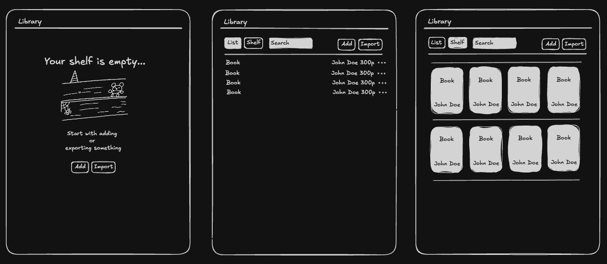
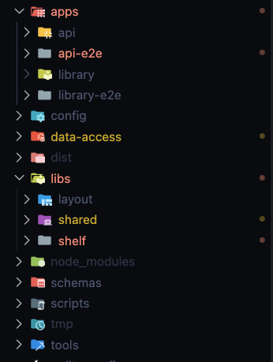
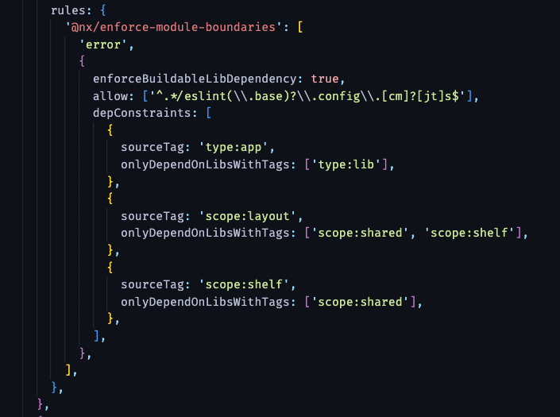
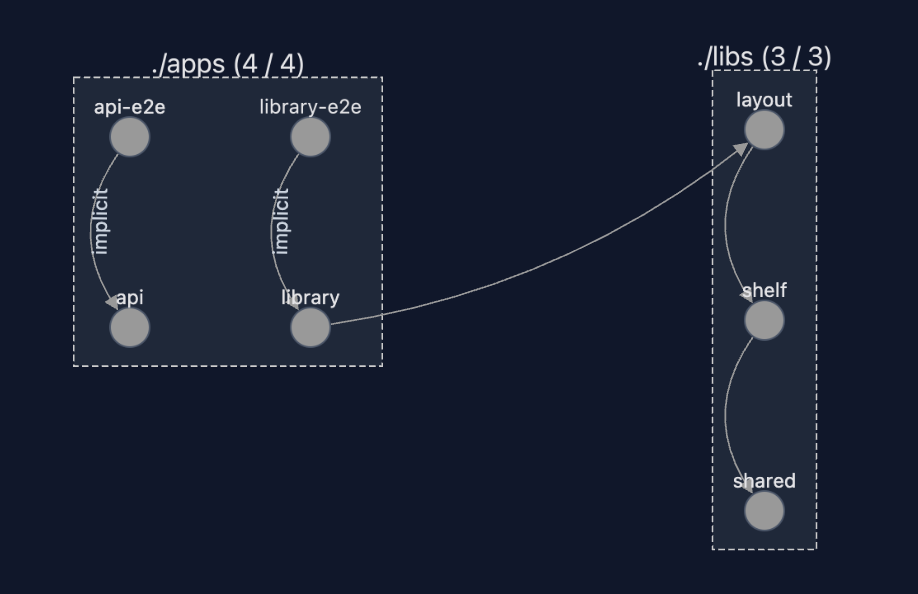
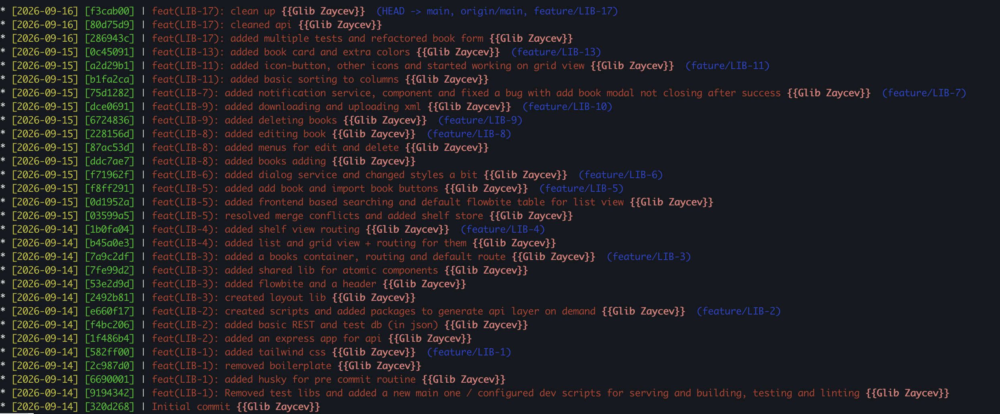

# Library App


# Description

The project depicts the digital shelf. User can add book manually or via importing them, search by books' titles, sort by title, author name and number of pages and export the library in the XML format to their disk.

Time spent: ~18 hours. (estimated 20)

# Stack

- **node 24.15.0**
- **npm 11.12.1**
- **Angular 22.1.4**
- **Angular CDK 22.1.6** - this was chosen to work with structural components like dialogs and menus, and serves as the backbone of the UI for the project.
- **NX 23.2.0** - this one was an overhead for the required functionality, however, given the nature of the project as a skills-and-reasoning-showcase, I've decided to include it as a package, since that would be an integral part in a decision making for the requirements of the role I'm interviewing for. NX gave me the space to isolate moving parts of the projects and provided the tooling for faster development, testing, linting and building.
- **TailwindCSS v4** - in my experience, this framework provides the best tooling for the quick and clean development, more importantly, it was a requirement for the design system I've chosen. Pure vanilla css with its modern capabilities would be a perfectly fine choice too.
- **Flowbite** - Tailwind-based component library for accessible UI primitives. Angular Material was the closest alternative, but I preferred the flexibility and speed of development that Flowbite + Tailwind gave me.
- **@ng-icons** - nice little tree shakeable lib to work with popular svg icons, that provides the access for more than 115000 icons (although 4 was enough for my scope this time)
- **ng-openapi-gen** - designing the API wasn't a part of the requirements, but I decided to choose this path to showcase the system design thinking and decision making. This package set me free from thinking about the API layer of the app, as it would automatically generate all models and services from the API docs.
- **husky** - to simplify the process of linting, testing and building of the app into one little chain
- **fast-xml-parser 5.11.1 + fast-xml-builder 1.3.1** - the problem of parsing XML and turning it to JSON and vice versa is a fascinating leetcode problem, but I had no time for this one, so just went with the popular solution that just works.
- **Vitest** - fastest and most efficient testing framework for modern frontend projects.

Other:

- **Prettier** - for consistent code formatting across the project.
- **express** - minimal web application written in the same language (TypeScript). NestJS was an option, but I really needed a barebones app with no additional abstractions.
- **axios** - a part of the scaffolded backend tests

# Architecture

### High level visual design

Using pencil, camera and Obsidian, I've created the initial mockups of the project. Using anything more complicated like Figma would be overkill, but I wanted to have the high level blocks for inspiration and just to offload the image from my head to the screen.

That was a starting point.



### General

**Key points:**

- Feature Based Architecture
- Angular Signals for state management
- Automated API layer generation
- Strict relations between all parts of the app

The project is divided into 2 apps, one is for the backend and one for the frontend. Although backend was out of the scope in the requirement, I've decided to give it a shot as I thought that would give the project a better shape according to the test nature of the task.

NX gives us the tooling for smart caching and development, also it suggests an opinionated structure with 2 core points: apps and libs / packages.

The core of the project is shown in the screenshot below.



**libs** folder only includes the frontend related libs and api app is fully sufficient on its own. Otherwise, it would make sense to structure it a bit differently to separate the code for the backend and a frontend, but for this project this is enough.

### State management

I decided to leave any state management libs out of the scope for this project, as it didn't make much sense for the size of the project. However, it would be pretty easy to integrate it on the project phase, and considering that I've chosen **Angular Signals** as a driver for the state management, NGRX Signals store would be my choice moving forward.

### Modules boundaries

All libs are isolated packages that live under the rules of relations specified in the **eslint** config file. This way we can control the dependencies and avoid circular dependencies.



### Structure

The architecture itself is pretty straightforward and NX built in tool "graph" can show us how it looks.



Libs are basically features. They **expose their own APIs** for other features to work with, if needed. It should have at least 1 exposed export, otherwise it makes no sense as it is never used by anything.

# Roadmap and progression

I've kept all my progress in the Trello board. Partially to show you my day to day, work process, and partially to keep the plan and steps in the reliable storage.

Here you can see my progress. I've kept the documentation in the very short format just to save time, but here you also can see what would be my next steps if I (or anyone after me) would keep working on the project.

[Trello Board](https://trello.com/invite/b/6aa7baef9367f49db846e46e/ATTId688a8f4dda9b8995fc5d53fb617c0749736E09F/fulcrum-library)

This is how I usually document my dev work:



### What was left out, and why

Some things were either skipped or just left out of work, mostly due to the lack of time. More precisely, what was omitted:

1. Fuller tests coverage. Unit, integration and e2e tests for the frontend part of the app. Playwright is already configured.
2. CI/CD and github connection - next thing would be creating an automated pipeline to deploy the app to the staging and prod environment
3. Authentication - skipped for now due to time constraints.
4. Pagination - skipped for the time constraints, but also the future design decision is yet unclear (it could be infinite scrolling or traditional pagination).
5. UI/UX improvement - in broad terms, the improvements of the feelings you get while working with the app.
6. Localization - is not needed for such a small project, but could be considered in the future if the project grows and needs to support multiple languages.

# How to run

```
git clone git@github.com:zaitsev1393/library.git
npm install
npm run dev
```
