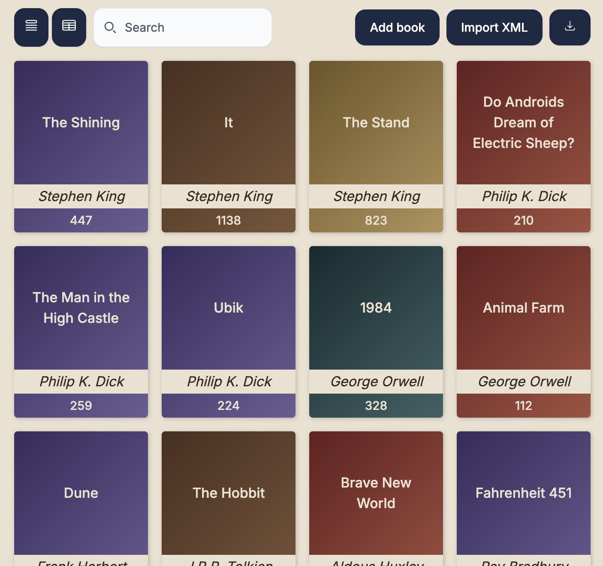

# Nx Angular Repository

# Description

The project depicts the digital shelf. Use can add book manually or via importing them, search by books' titles, sort by title, author name and number of pages and export the library in the XML format to their disk.

Time spent: ~18 hours. (estimated 20)

# Stack

- **node 24.15.0**
- **npm 11.12.1**
- **Angular 22.1.4**
- **Angular CDK 22.1.6** - this was chosen to work with structural components like dialogs and menus, and serves as the backbone of the UI for the project.
- **NX 23.2.0** - this one was an overhead for the required functionality, however I accounted the nature of the project as a skills and reasoning showcase and decided to include it as package like that would be an integral part in decision making for the requirements of the role I'm interviewing for. NX gave me the space to isolate moving parts of the projects and provided the tooling for faster development, testing, linting and building.
- Angul
- **TailwindCSS v4** - in my experience, this framework provides the best tooling for the quick and clean development, more importantly, it was a requirement for the design system I've chosen. Pure vanilla css with it's modern capabilities would be a perfectly fine choice too.
- **Flowbite** - Tailwind-based component library for accessible UI primitives. Angular Material was the closest alternative, but I preferred the flexibility and speed of development that Flowbite + Tailwind gave me.
- **@ng-icons** - nice little tree shakeable lib to work with popular svg icons, that provides the access for more than 115000 icons (although 4 was enough for my scope this time)
- **ng-openapi-gen** - although designing the API or anything related to that wasn't a part of the requirements, I've decided to chose this path to showcase the system design thinking and decision making. This little package set me free from thinking about API layer of the app, as it would automatically generate all models and services from the API docs.
- **husky** - to simplify commiting process and glue linting, testing and building of the app into one little chain
- **fast-xml-parser 5.11.1 + fast-xml-builder 1.3.1** - the problem of parsing XML and turning it to JSON and vice versa is a fascinating leetcode problem, but I had no time for this one, so just went with the popular solution that just works.
- **Vitest**

Other:

- express - for the REST API
